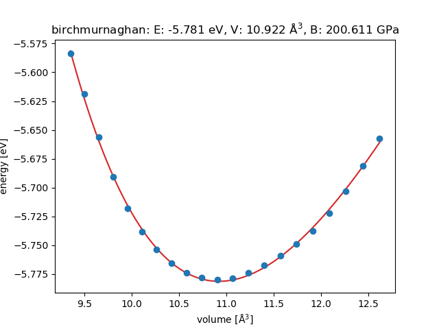

# TensorAlloy

**TensorAlloy** is a TensorFlow based machine learning framework for alloys. 

## 1. Requirements

* Python>=3.7.0
* TensorFlow==1.14.0
* scikit-learn
* scipy
* numpy
* ase>=3.18.0
* matplotlib>=3.0.0
* atsim.potentials>=0.2.1
* toml==0.10.0
* joblib
* pandas

`ase`, `toml` and `joblib` can be installed with `pip` easily. Other packages 
may be installed with Anaconda3. However, the performance of conda-provided 
tensorflow may not be that good. Natively compiled TensorFlow, with all CPU 
features (SSE, AVX, etc.) enabled, is highly recommended. 

## 2. Installation

This package can be installed with `pip` or `python`:

```bash
cd tensoralloy
pip install .
```

or 

```bash
cd tensoralloy
python setup.py install
```

A command-line interface `tensoralloy` will also be installed.

## 3. Training

### 3.1 Usage

[TOML](https://github.com/toml-lang/toml) is the configuration file format used
by TensorAlloy. All the necessary keys are included in the two examples. Default
keys and values can be found in 
[default.toml](tensoralloy/io/input/defaults.toml).

To run a training experiment, the easiest way is using the command-line program 
`tensoralloy`. Here are some key commands:

* `tensoralloy build database [extxyz]`: build a database from an `extxyz` file. 
* `tensoralloy run [input.toml]`: run an experiment from a `toml` input file. 
* `tensoralloy print [logfile]`: read the evaluation results from a logfile and 
print these results to a csv file.
* `tensoralloy --help`: print the help messages.

### 3.2 Output

After the training, a binary `pb` file (the trained model) will be exported to 
the `model_dir` specified in the input toml file. This exported `pb` file can be
used by the ASE-style [`TensorAlloyCalculator`](tensoralloy/calculator.py). 

For pair styles `eam/alloy`, `eam/fs` and `eam/adp`, the corresponding LAMMPS
potential file will also be exported.

We provide three examples as well as their optimized potentials:

* [Ni](examples/Ni): `eam/alloy`
* [Mo](examples/Mo): `eam/adp`
* [MoNi](examples/Mo-Ni): `eam/adp`

The corresponding symmetry function based atomistic neural network potentials
for these systems can be found on our 
[previous work](https://doi.org/10.1016/j.cpc.2019.107057)


## 4. Prediction

The ASE-style calculator, [`TensorAlloyCalculator`](tensoralloy/calculator.py), 
shall be used to make predicitons.

```python
#!coding=utf-8
""" Simple usage. """
from tensoralloy.calculator import TensorAlloyCalculator
from ase.build import bulk
from ase.units import GPa

calc = TensorAlloyCalculator("examples/Ni/Ni.pb")
atoms = bulk("Ni", cubic=True)
atoms.calc = calc
print(atoms.get_total_energy())
print(atoms.get_forces())
print(atoms.get_stress() / GPa)
```

## 5. Input

In this section we will introduce the options and values of the input file.
Options marked **[required]** must be set manually in the input file.

**TensorAlloy** uses [TOML](https://github.com/toml-lang/toml) files as inputs.
The following section demonstrates how to write a toml file.

##### TOML

In the toml file, there are two ways to set a nested key-value pair `A.B.C="x"`:

```toml
[A.B]
C="X"
```

or

```toml
A.B.C="x"
```

In this guide, all options are expressed in the second style for simplicity. But
in the input file, either can be used.

### 5.1 Root

* `precision`: `medium` (float32) or `high` (float64). Default is `medium`.
* `seed`: the global seed, default is 611.
* `pair_style` **[required]**: the potential style to use:
    - eam/alloy: [embedded-atom method](https://doi.org/10.1103/PhysRevB.69.144113)
    - eam/adp: [angular-dependent potential](https://doi.org/10.1016/j.actamat.2005.05.001)
    - atomic/sf: [symmetry function based atomistic neural network potential](https://doi.org/10.1016/j.cpc.2019.107057)
* `rcut`: the cutoff radius in angstroms. Default is 6.5.

### 5.2 Dataset

* `dataset.sqlite3` **[required]**: a string, the 
[ASE Sqlite3 Database](https://wiki.fysik.dtu.dk/ase/ase/db/db.html#module-ase.db) 
to use.
* `dataset.name` **[required]**: a string, the name of this experiment.
* `dataset.tfrecords_dir`: a string, the directory to save/load tfrecords files.
* `dataset.test_size`: an integer, the number of examples for evaluation.
* `dataset.serial`: a boolean. Default is `false`. Typically this should be 
false so that structures in the sqlite3 database can be written to tfrecords in 
parallel. For some old Linux systems or debugging, this can be set to `true`. 

### 5.3 NN

This section defines the potential model parameters.

#### General options

* `nn.minimize`: a list of string, the properties to minimize. Some examples: 
`["energy", "forces"]`, `["energy", "stress"]`
* `nn.export`: a list of string, the properties that the exported model should 
predict. This option has the same format with `nn.minimize`.

#### 5.3.1 Atomic

This section defines parameters for pair style `atomic/sf`.

* `nn.atomic.kernel_initializer`: a string, the initialization method.
* `nn.atomic.use_atomic_static_energy`: a boolean. If True, a bias unit will 
be added to the output layer acting as the elemental static energy. 
Section 3.7 of [tensoralloy](https://doi.org/10.1016/j.cpc.2019.107057) paper 
describes this residual model in detail.
* `nn.atomic.fixed_atomic_static_energy`: a boolean. If True, the elementary 
static energy parameters will be kept fixed.
* `nn.atomic.minmax_scale`: a boolean. If True, min-max normalization (
section 3.6 of [tensoralloy](https://doi.org/10.1016/j.cpc.2019.107057)) will
be applied to the descriptors.

* `nn.activation`: a string, the activation function to use. Options are:
`elu`, `leaky_relu`, `softplus`, `softsign`, `tanh`, `sigmoid`. Default is 
`softplus`.

##### Hidden layers

Neural network hidden layers are set under scope `nn.atomic.layers`. This block 
is optional. The default setting for arbitrary type of element is `[64, 32]`.

```toml
[nn.atomic.layers]
Mo = [128, 64, 32]
Ni = [64, 64]
``` 

##### Symmetry function atomistic neural network parameters

This section describes the specific parameters for the symmetry function based
atomistic neural network potential.

* `nn.atomic.sf.eta`: a list of float, the eta values for radial symmetry 
functions. Default is `[0.01, 0.1, 0.5, 1.0, 4.0]`.
* `nn.atomic.sf.omega`: a list of float, the omega values for radial symmetry 
functions. Default is `[0.0]`.
* `nn.atomic.sf.beta`: a list of float, the beta values for angular symmetry 
functions. Defaults is `[0.005]`.
* `nn.atomic.sf.gamma`: a list of float, the gamma values for angular 
symmetry functions. Default is `[1.0, -1.0]`.
* `nn.atomic.sf.zeta`: a list of float, the zeta values for angular symmetry 
functions. Default is `[1.0, 4.0]`.
* `nn.atomic.sf.angular`: a boolean. If true, angular symmetry functions 
will be used. Otherwise `gamma`, `zeta` and `beta` will be ignored.
* `nn.atomic.sf.cutoff_function`: a string selecting the cutoff function to 
use, `cosine` (default) or `polynomial`.

#### 5.3.2 EAM/ADP

This section describes the options for pair styles under `eam`.

##### Functions

`rho`, `phi`, `embed`, `dipole` and `quadrupole` functions are all defined in 
the similar way.

```toml
[nn.eam.rho]
Ni = "zjw04xc"

[nn.eam.dipole]
NiNi = "mishinh"
```

The block above sets the rho function of __Ni__ to 
[`zjw04xc`](tensoralloy/nn/eam/potentials/zjw04.py) and the dipole function of 
__Ni-Ni__ to [`mishinh`](tensoralloy/nn/eam/potentials/mishin.py).

Built-in functions: 

```text
available_potentials = {
    'sutton90': AgSutton90,
    'zjw04': Zjw04,
    'zjw04xc': Zjw04xc,
    'zjw04uxc': Zjw04uxc,
    'zjw04xcp': Zjw04xcp,
    'msah11': AlFeMsah11,
    "mishinh": MishinH,
}
```

##### Customized functions

``zjw04`` represents the original functions proposed by Zhou, Johnson and Wadley 
in [2004](https://doi.org/10.1103/PhysRevB.69.144113). `zjw04xc`, `zjw04uxc` and 
`zjw04xcp` are all customized implementations. 

The dict [``available_potentials``](tensoralloy/nn/eam/potentials/__init__.py) 
must be set in order to make customized functions usable.

##### SetFL

EAM and ADP will be exported to LAMMPS SetFL potential files. This block defines
the related parameters.

```toml
[nn.eam.setfl]
nr = 10000
dr = 0.00065
nrho = 10000
drho = 0.01
```

`nrho` and `nr` are the number of tabulated values in the subsequent arrays,
`drho` and `dr` are the spacing in density and distance space for the values in 
those arrays. See 
[Lammps manual](https://lammps.sandia.gov/doc/pair_eam.html) for more 
information.

#### 5.3.3 Loss options

This section describes the options for computing the total loss.

##### Energy
* `nn.loss.energy.weight`: a float, the weight of the energy loss. Default is 1.
* `nn.loss.energy.per_atom_loss`: a boolean. If true, per-atom energy loss will 
be used. Default is false.
* `nn.loss.energy.method`: a string, `"rmse"` or `"logcosh"`.

##### Forces
* `nn.loss.forces.weight`: a float, the weight of the force loss. Default is 1.
* `nn.loss.forces.method`: a string, `"rmse"` or `"logcosh"`.

##### Stress
* `nn.loss.stress.weight`: a float, the weight of the force loss. Default is 1.
* `nn.loss.stress.method`: a string, `"rmse"` or `"logcosh"`.

##### L2 regularization
* `nn.loss.l2.weight`: a float, the weight of the L2 regularization. Default is 
  1.0. __Note: adaptive optimizers (adam, nadam, etc) are not compatible with 
  L2. If you use any adaptive optimizer, please set this to 0.__
* `nn.loss.l2.decayed`: a boolean. If True, the L2 weight will decay exponentially.
* `nn.loss.l2.decay_rate`: a float controls the decay rate.
* `nn.loss.l2.decay_steps`: an integer.

##### Structural toml file

[Mo.dft.toml](examples/Mo/Mo.dft.toml) is a structural toml file defining 
essential parameters for physical constraints.

```toml
name = "Mo"
file = "Mo.dft.cif"
format = "cif"
phase = "bcc"
bulk_modulus = 263.0

c11 = 472
c12 = 158
c44 = 106
```

* `name`: a string, the name of this material.
* `file`: a string, the structure file.
* `format`: the format of this file, must be recognized by `ase.io.read`. 
Generally, __cif__ and __extxyz__ are recommended.
* `phase`: a string, the phase of this structure.
* `bulk_modulus`: a float, the bulk modulus (GPa) of this material.
* `c11, c12, c44, ...`: float numbers, the elastic constants (GPa).

##### Built-in crystals

TensorAlloy has several built-in crystals (Ni, Mo, etc). See this 
[file](tensoralloy/nn/constraint/data.py) for more information.

##### Rose EOS

This section defines parameters of the Rose constraint.

* `nn.loss.rose.crystals`: a list of string, the names or files of crystals for 
constructing Rose EOS constraints. As an example, `["Ni", "Mo.dft.toml"]` means
the built-in crystal `Ni` and the crystal specified in `Mo.dft.toml` will be 
used.
* `nn.loss.rose.weight`: a float, the weight of Rose constraints.
* `nn.loss.rose.beta`: a list of float, the beta values for each crystal. The 
size of this list must be equal to the size of `nn.loss.rose.crystals`.

`nn.loss.rose.dx` and `nn.loss.rose.delta` controls the number of points to fit
EOS curves. `nn.loss.rose.delta` is the limit of the isotropic scaling factor.
The volume will range from `(1 - delta)**3` to `(1 + delta)**3` of the 
equilibrium volume.



The figure above shows the fitted EOS of fcc Ni.

##### Elastic Tensor

This section defines parameters of the elastic tensor constraint.

* `nn.loss.elastic.crystals`: a list of string, the names or files of crystals to 
use.
* `nn.loss.elasitc.weight`: a float, the weight of elastic constraints.

When computing the elastic constants, the crystals should be close to their 
equilibrium structure. In other words, the norms of forces and stress tensor 
should be close to zero. `nn.loss.elastic.constraint.forces_weight` and 
`nn.loss.elastic.constraint.stress_weight` are used to define the weights of the
norms of forces and stress tensor.

`nn.loss.elastic.constraint.tau` corresponds to the tau value (unit is GPa) of 
equation 32 in the paper.

### 5.4 Opt

* `opt.method`: a string, the optimizer to used. Options are: `adam`, `nadam`, 
`sgd`, `adadelta`, `rmsprop`. Default is `adam`.
* `opt.learning_rate`: a float, the initial learning rate. Default is 0.01.
* `opt.decay_function`: a string, the decay function to use. Options are: 
`exponential`, `inverse_time`, `natural_exp`. Default is `false` which means 
learning rate decay is disabled.
* `opt.decay_rate`: a float, the decay rate.
* `opt.decay_steps`: an integer, the decay step.
* `opt.staircase`: a boolean.

### 5.5 Train

* `train.reset_global_step`: a boolean. If True, the global step will be set to 
0 by force. If you want to continue a previous training, this should be changed 
to `false`.
* `train.batch_size`: an integer, the batch size. Default is 50.
* `train.shuffle`: a boolean. If True, the input dataset will be shuffled. In 
most cases this should be true.
* `train.model_dir`: a string, the working directory for this experiment.
* `train.max_checkpoints_to_keep`: an integer, the maximum number of 
checkpoint files to keep in the model dir.
* `train.train_steps`: an integer, the maximum training steps.
* `train.eval_steps`: an integer, the intervals between two evaluations.
* `train.summary_steps`: an integer, the intervals between two writing summary 
operations.
* `train.log_steps`: an integer, the intervals between two logging operations.
* `train.profile_steps`: an integer, the intervals between two performance 
profiling operations. Set this to 0 to disable profiling.

* `train.ckpt.checkpoint_filename`: a string, the previous checkpoint file to 
read. Default is `false`.
* `train.ckpt.use_ema_variables`: a boolean. If `train.ckpt.checkpoint_filename` 
is provided, the moving average variables will be loaded if this is true.
* `train.ckpt.restore_all_variables`: a boolean. It only works when 
`train.ckpt.checkpoint_filename` is provided. If this is true, all variables 
(including the optimizer-specific variables) will be loaded. If false, only 
model variables will be used. Typically, if you want to continue a previous 
training with exactly the same settings but more training steps, set 
`train.reset_global_step` to false and this option to true. If you want to use
the checkpoint values as initial guesses, this option shall be false.

## 6. Licenses

### TensorAlloy

This TensorAlloy program is licensed under GNU Lesser General Public License 
v3.0. For more information please read [LICENSE](LICENSE).

### SNAP

The SNAP database and its subsets SNAP-Ni and SNAP-Mo are published by Shyue 
Ping Ong. The original JSON files can be obtained from 
[GitHub](https://github.com/materialsvirtuallab/snap) freely. The original 
dataset is also licensed under BSD-3.
